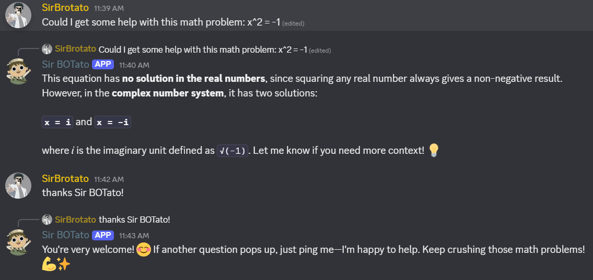

# SirBOTato

A small [discord.py](https://discordpy.readthedocs.io/) bot that sends Discord prompts to a local [Ollama](https://ollama.com/) chat model through the OpenAI Python SDK and Ollama's OpenAI-compatible API. A LangGraph workflow first asks the model whether a message is meant for the bot, then generates a response only when it is.



Notice how here the bot detects it's being spoken to without being explictly pinged or calling any commands.

## Structure

- `bot.py` — application entry point.
- `src/config.py` — environment configuration.
- `src/discord_bot.py` — Discord client, events, and response formatting.
- `src/model_inference.py` — OpenAI SDK/Ollama calls and per-channel history.
- `src/intent.py` — model-based intent classification.
- `src/workflow.py` — LangGraph routing and nodes.

## Setup

1. Install Python 3.10 or newer, then create and activate a virtual environment:

   ```powershell
   py -m venv .venv
   .\.venv\Scripts\Activate.ps1
   pip install -r requirements.txt -r requirements-langgraph.txt
   ```

2. Install and start Ollama, then download the model (use the exact name available in your Ollama library):

   ```powershell
   ollama pull qwen3.6
   ollama serve
   ```

3. In the [Discord Developer Portal](https://discord.com/developers/applications), create an application and bot. Under **Bot**, enable the **Message Content Intent**. Generate an installation URL with the `bot` scope and the permissions to View Channels, Send Messages, Read Message History, and Embed Links; then invite it to your server.

4. Copy `.env.example` to `.env`, set `DISCORD_TOKEN`, and adjust the Ollama settings if needed:

   ```powershell
   Copy-Item .env.example .env
   ```

5. Run the bot:

   ```powershell
   python bot.py
   ```

## Use

- Mention the bot in a server: `@YourBot explain black holes simply`.
- Or address it naturally in a server; the model decides whether the message is meant for the bot.
- Direct messages are classified as intended for the bot.
- Send `!reset` in a DM or address it to the bot to clear that channel's saved context.

`MAX_HISTORY_MESSAGES` controls the number of stored user/assistant messages per conversation (default 20); use `0` for stateless prompts. The OpenAI SDK is pointed at `LLM_BASE_URL/v1` (default `http://127.0.0.1:11434/v1`), so model traffic stays local. `LLM_API_KEY` may stay as `ollama` for Ollama's default local server.
